# MEMO_EXP06: Phantom Study on Brain Signal Recovery During Brain Stimulation

## Abstract

We tested whether we can recover a known 12.5 Hz oscillation (applied to a phantom) during and after repetitive transcranial magnetic stimulation (iTBS protocol). We varied stimulation intensity from low (10%) to high (50%) to see where our signal recovery method breaks down.

**The main finding:** We can reliably recover the signal *after* stimulation stops, even at high intensities. However, during active stimulation, we can only recover it at low-to-mid intensities (10–30%). At high intensities (40–50%), the electrodes become "saturated" as they accumulate electrical charge from the stimulation.

---
## Introduction

### Background

In earlier experiments, we learned that we *can* extract brain signals right after the stimulation pulse ends. Now we want to know **What happens if we keep stimulating repeatedly at different power levels?** Can we still recover the signal during the stimulation, or does it get buried under the electrical artifact?

### Why This Matters

Before we can trust our method to measure real brain activity, we need to prove it works on a phantom (a known, controlled test case). If we can't recover our known 12.5 Hz signal from the phantom despite all the electrical noise, there's no hope of finding weaker, natural brain signals in a real brain.

---

## Methods

### Participants and Data Acquisition

All recordings were phantom (no human subjects). Two sessions were analyzed:
- **Baseline**: 321.18 s of baseline recording with no stimulation, 12.5 Hz ground-truth  oscillation, 1000 Hz sampling rate, 28 retained EEG channels .
- **exp06-STIM-iTBS_run02.vhdr**: 600 s of a modified iTBS stimulation (2s of 5Hz stimulation with 3 50Hz pulses and 4s OFF )

### Baseline SSD Reference Establishment

In the baseline session (no stimulation), we built a spatial filter to extract the 12.5 Hz signal. We used SSD (spectral source decomposition) to find a weighted combination of the 28 electrodes that maximized power at 12.5 Hz relative to neighboring frequencies. 

### Late-OFF Transfer

To test whether the baseline SSD solution generalizes to post-offset conditions:

1. Applied the  baseline SSD weights to late-OFF windows (1.5–3.2 s after stimulus offset) across all five intensity blocks.
2. Computed the spectral peak frequency and phase-locking (ITPC: inter-trial phase coherence) to the ground-truth channel.

### ON-State SSD Fitting

For each intensity block (10%, 20%, 30%, 40%, 50%), we fit SSD separately on the ON windows (0.3–1.5 s after stimulus onset) to check if the optimal spatial decomposition changed under stimulation. We recorded the spectral peak frequency (target or artifact harmonic), and phase-locking (ITPC) to ground-truth. Spectral validity (whether the peak occurred at 12.5 Hz) was the primary criterion.

---

## Results

### Baseline SSD Reference is Strong and Posterior-Localized

The baseline SSD component recovered the 12.451172 Hz target with a peak-to-flank ratio of 279.33 (power at 12.45 Hz is 279 times the neighboring frequencies). The top five raw channels ranked by 12–13 Hz power (O2, P8, Oz, P4, O1) matched the SSD spatial pattern, confirming we isolated the true target.

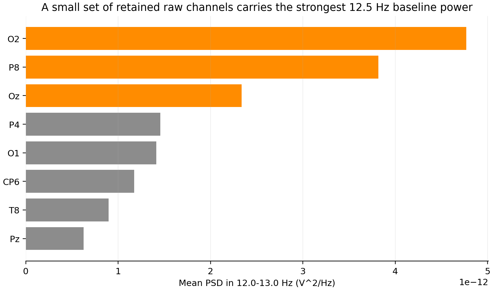

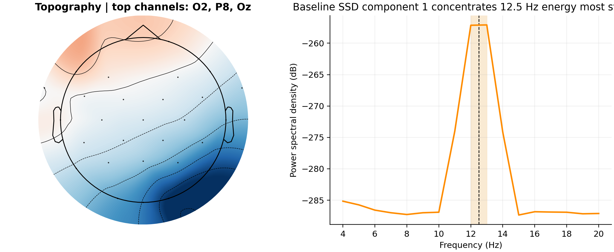

### Late-OFF: Baseline SSD Generalizes Across All Intensities

The frozen baseline SSD recovered the correct peak (12.451172 Hz) in all five intensity blocks during late-OFF windows. Phase-locking (ITPC) values were near ceiling (>0.998):

| Intensity | SSD ITPC | Raw O2 ITPC | SSD Advantage |
|-----------|----------|------------|---------------|
| 10%       | 0.9983   | 0.9973     | +0.0010       |
| 20%       | 0.9990   | 0.9975     | +0.0015       |
| 30%       | 0.9992   | 0.9978     | +0.0014       |
| 40%       | 0.9994   | 0.9977     | +0.0017       |
| 50%       | 0.9995   | 0.9985     | +0.0010       |

The SSD advantage over raw O2 was minimal (<0.002), but the critical finding is that the baseline spatial filter generalizes to all intensities during OFF periods—ruling out a global design failure.

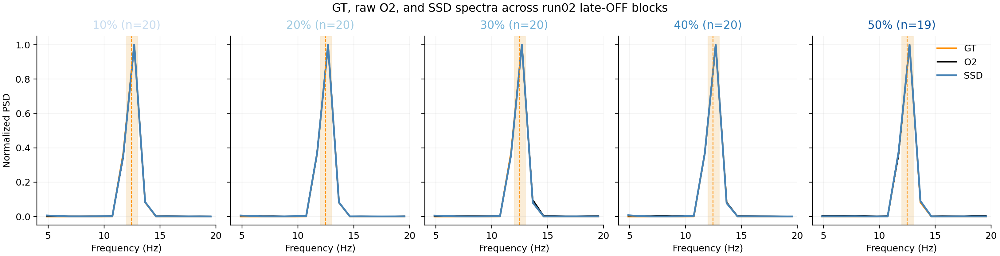

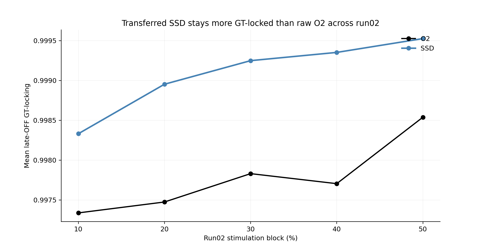

### ON-State Recovery Fails at High Intensity

Results of ON-state SSD fitting:

| Intensity | Spectral Peak Location | Peak-to-Flank | SSD ITPC | Raw O2 ITPC |
|-----------|------------------------|---------------|----------|------------|
| 10%       | 12.45 Hz ✓             | 1.348         | 0.966    | 0.843      |
| 20%       | 12.45 Hz ✓             | 14.182        | 0.979    | 0.910      |
| 30%       | 12.45 Hz ✓             | 6.584         | 0.970    | 0.941      |
| 40%       | **10.00 Hz (artifact)** | 0.675         | 0.500    | 0.996      |
| 50%       | **10.00 Hz (artifact)** | 0.975         | 0.624    | 0.9995     |

x
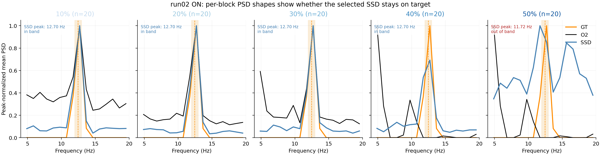

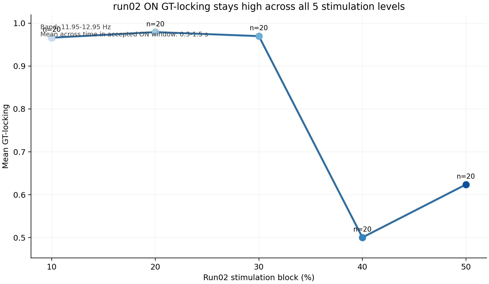

### Raw Artifact Is Spatially Heterogeneous

Artifact magnitude during stimulation (mean absolute cycle amplitude):

| Channel | 10%    | 20%    | 30%      | 40%      | 50%       |
|---------|--------|--------|----------|----------|-----------|
| O1      | 9.9 µV | 16.1 µV| 403.1 µV | 837.9 µV | 1169.8 µV |
| O2      | 2.8 µV | 2.8 µV | 2.9 µV   | 528.7 µV | 2771.1 µV |
| Pz      | 1.5 µV | 1.8 µV | 2.3 µV   | 2.0 µV   | 1.9 µV    |

O2 stays clean through 30% then saturates 180-fold at 40%. O1 grows monotonically. 
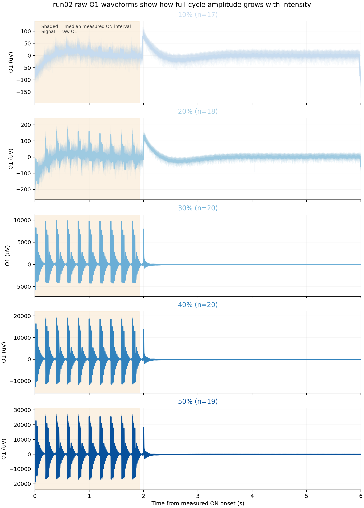

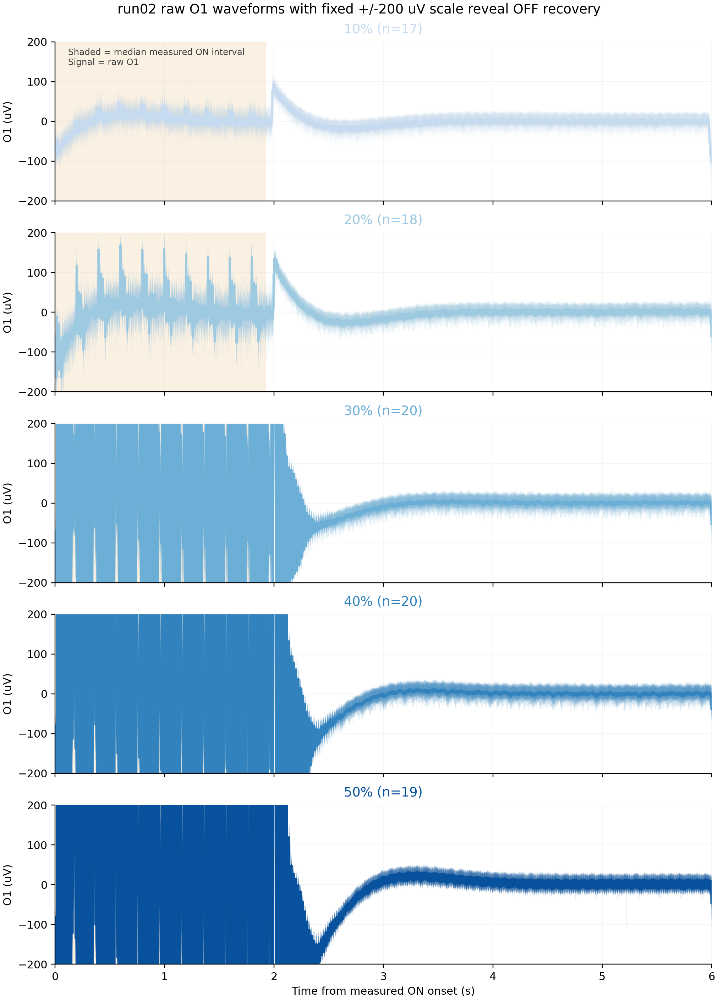

---

## Discussion

### Summary of Findings

exp06 provides a three-state characterization of phantom oscillatory recoverability across iTBS intensities:

1. **Baseline** (no stimulation): Strong, unambiguous recovery. SSD isolates the 12.5 Hz target with high SNR (target-vs-flank = 279) .

2. **Late-OFF** (1.5–3.2 s after measured offset): Robust recovery across all intensities. Frozen baseline SSD generalizes perfectly, maintaining spectral validity and near-ceiling GT-locking (ITPC > 0.99) in all five blocks.

3. **ON-state** (0.3–1.5 s after measured onset): Intensity-dependent and channel-dependent failure. At 10–30%, the target is recoverable via SSD with GT-locking > 0.96 and stable spectral peak at 12.45 Hz. At 40–50%, the raw O2 spectral peak shifts to the 10 Hz harmonic of the iTBS stimulation, and SSD spatial filtering breaks (peak-to-flank ratio <1.0) due to artifact dominance .

### The Artifact Is Spatially Heterogeneous

Different electrodes have different saturation thresholds, growth curves, and settling rates.

### Next steps for Human Brain Translation

The path forward requires:

1. **Artifact separation before hypothesis testing.** The phantom shows that the target is recoverable, but only with strong SNR. Real-brain data will require improved artifact removal, not SSD-only filtering.

2. **Comparison of multiple denoising approaches.** At minimum, channel-wise decay modeling or template subtraction should be tested.

---

## Conclusions

exp06 successfully characterizes the recoverability landscape of a phantom iTBS target across intensities. We show that:

We encourage artifact separation modeling as a **prerequisite**, before iTBS, for future directions linked to realtime phase tracking.

---

## Appendix: EXP04 — First Real-Brain Pilot (100% Intensity, Single Subject)

> **Status:** Exploratory pilot. Single subject, no replication. All findings are tentative candidate observations. 

### Overview

EXP04: Applied TIMS protocol to a real human participant. Three segments were collected: a closed-eyes resting-state baseline before stimulation, a stimulation run (single pulses at 100% intensity, 75 pulses), and a closed-eyes resting-state baseline after stimulation. 2 analyses were run: TEPs and pre/post resting-state dynamics (band power and connectivity).

---

### Methodology

#### Connectivity Metrics: PLV and wPLI

**PLV (Phase-Locking Value)** measures phase synchrony between two EEG channels. It is computed as the magnitude of the mean complex phase difference across epochs or time:

$$\text{PLV} = \left| \frac{1}{N} \sum_{n=1}^{N} e^{i \Delta\phi_n} \right|$$

where $\Delta\phi_n$ is the **instantaneous phase difference** between 2 channels in epoch $n$. A PLV of 1 = same phase relationship; a PLV of 0 = random. If two electrodes sit close together, they can appear synchronized because of volume conductance

**wPLI (weighted Phase Lag Index)** corrects for this by discarding zero-lag components. It removes near perfect phase relationships (by removing imaginary part... I guess):

$$\text{wPLI} = \frac{\left| \langle \text{Im}[C_{xy}] \rangle \right|}{\langle \left| \text{Im}[C_{xy}] \right| \rangle}$$

where $C_{xy}$ is the cross-spectrum between channels $x$ and $y$, and the angle brackets denote averaging over epochs. A wPLI of 0.3 means the phase lag between the two channels is moderate and directionally consistent==>  sign of true functional connectivity . Both metrics are computed here per epoch then averaged across the left motor ROI (F3, FC5, FC1, C5, C1, CP5), right motor ROI (F4, FC6, FC2, C6, C2, CP6), and interhemispheric pairs.

---

### Results: TEP Analysis

The TEP pipeline produced a three-panel figure comparing pre, stim, and post evoked responses (0.08–0.50 s post-pulse) across five ROI channels.

⚠️ **Warnung** Whether the exponential decay subtraction was sufficient to clean the 100% intensity artifact cannot be determined from the experiment.

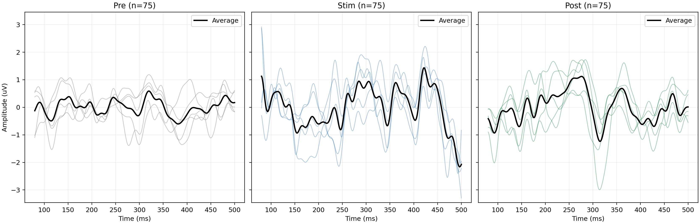

#### TEP Topographic Analysis (plot_joint, all channels)

**Methods.** The matched-triplet pipeline was re-run without ROI restriction so that all 19 retained channels contributed to the evoked average. MNE's `evoked.plot_joint()` was called per condition with `times="peaks"` (GFP-based automatic peak selection) and a fixed y-axis of ±4 µV across all three panels for direct amplitude comparison. All other parameters are identical: baseline −1.9 to −1.3 s, crop 0.08–0.50 s, 42 Hz low-pass, per-channel exponential decay removal, n=75 epochs per condition.

**Results.** The three conditions show broadly consistent waveform morphology across the 0.08–0.50 s. The Stim panel shows a prominent negative–positive complex peaking around 0.24–0.29 s with a clear central-parietal topography. Whether the Stim-specific amplitude and topographic differences reflect a genuine TEP or residual artifact cannot be resolved without artifact characterization.

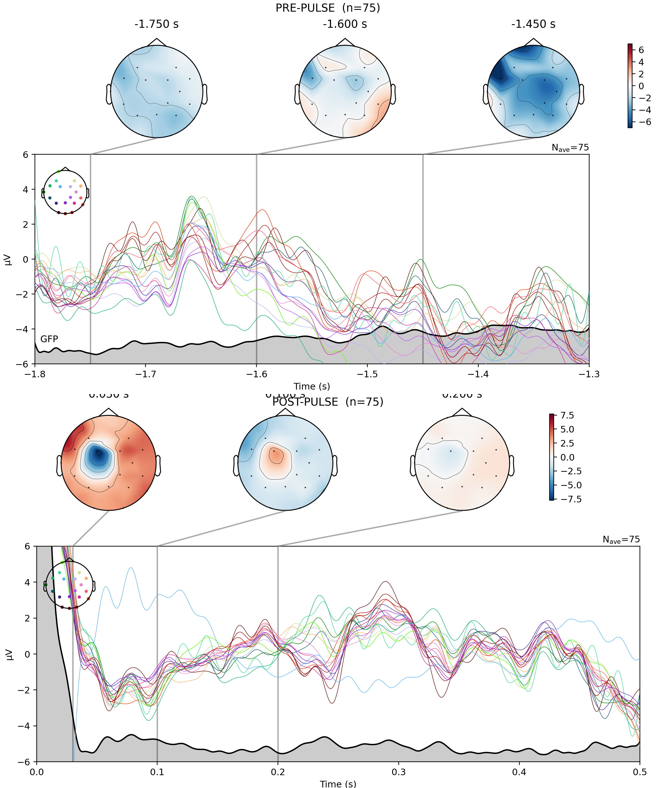

---

### Results: Pre/Post Resting-State Dynamics

#### Band Power and PLV (Left Motor ROI: F3, FC5, FC1, CP5)

All five metrics survived FDR correction. p-values from permutation tests; q = FDR-corrected.

| Metric             | Pre    | Post   | % change | p      | q      | Cohen's d |
|--------------------|--------|--------|----------|--------|--------|-----------|
| Theta power (V²)   | 7.1e−12 | 31.9e−12 | **+348%** | 0.0004 | 0.0015 | 0.59 |
| Alpha power (V²)   | 13.1e−12 | 25.7e−12 | **+96%** | 0.008  | 0.014  | 0.62 |
| Theta/alpha ratio  | 0.84   | 1.09   | +30%     | 0.069  | 0.069  | 0.44 |
| Theta PLV          | 0.691  | 0.741  | +7%      | 0.0006 | 0.0015 | 0.42 |
| Alpha PLV          | 0.657  | 0.686  | +4%      | 0.037  | 0.046  | 0.23 |

The dominant finding is a **large increase in absolute theta and alpha power post-stimulation (roughly 4.5× and 2× respectively)**, accompanied by modest but significant increases in theta and alpha PLV within the left motor ROI. 

**Interpretation and caveats:**

The power increase and PLV increase could reflect a genuine post-stimulation effect—for instance, increased cortical excitability or rebound oscillations following a period of inhibition. However, the more "occam's razor" explanation at this stage is probably **that the subject was just tired**: The theta/alpha ratio shift toward theta dominance is a well-known marker of drowsiness onset. Alpha and theta absolute power both increase as participants relax or become drowsy, independent of any stimulation. Without a sham condition, the two explanations cannot be separated.

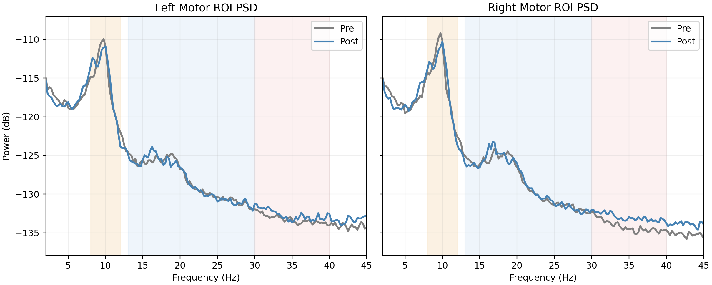

#### wPLI (Functional Connectivity)

| Band      | Network              | Pre   | Post  | Δ      |
|-----------|----------------------|-------|-------|--------|
| Beta      | Within left          | 0.207 | 0.223 | +7.6%  |
| Low gamma | Interhemispheric     | 0.130 | 0.145 | +11.3% |
| Alpha     | Interhemispheric     | 0.343 | 0.333 | −2.9%  |
| Beta      | Within right         | 0.208 | 0.194 | −6.6%  |

All other wPLI changes were <5%. Unlike PLV, wPLI suppresses zero-lag components (volume conduction), so its a more conservative measure of true directional connectivity. Because wPLI is weaker than the PLV, we should be wary of any conclusion about brain changes.

⚠️ **Distribution and node-strength figures** should be inspected for outlier epochs driving any apparent changes.

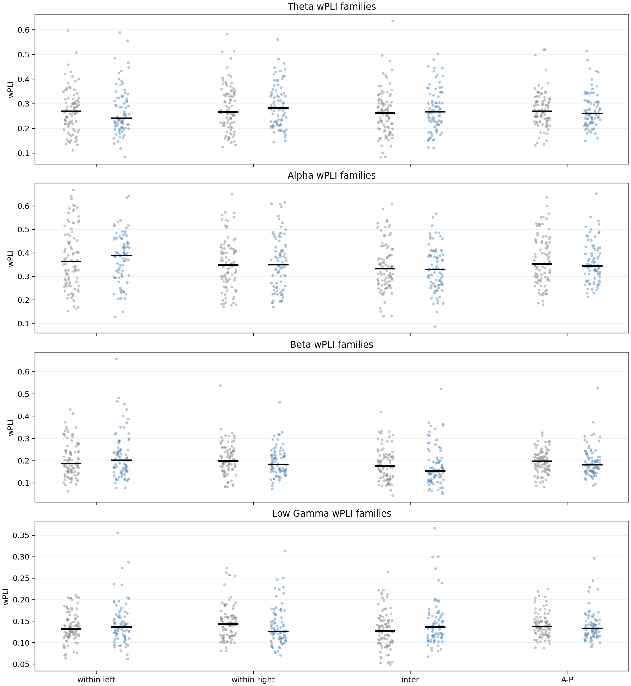

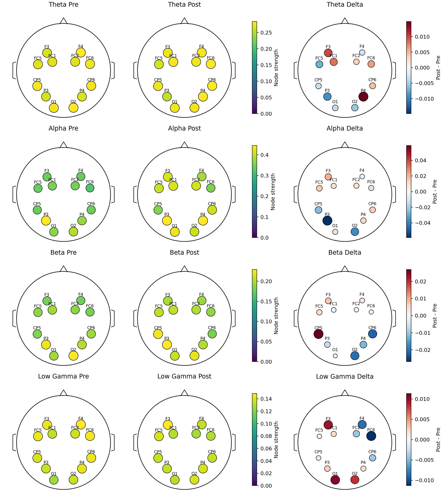

#### Value as a Prior for Future Experiments

Even setting aside the attribution problem, EXP04 establishes  a quantitative baseline for this participant: Alpha/Theta Ratios, and expected wPLI. This provides a prior for what to expect in future sessions, to compare against other stimulation protocols (like iTBS/cTBS). We will  then evaluate the TBS direction is worth pursuing with a hypothesis-driven design.

---

#### Signal Processing Pipeline

**Resting-state analysis:**
- Dropped known bad channels; applied average reference, 1–45 Hz bandpass, 50 Hz notch
- Split each recording into 4-second non-overlapping epochs (35 pre, 32 post)
- Per epoch: Welch PSD → integrated absolute and relative band power for alpha, beta, low gamma; bandpass filter → Hilbert transform → wPLI matrix per frequency band
- Statistical comparison: permutation test with Benjamini-Hochberg FDR correction; Cohen's d reported

**Post-pulse spectral analysis (ERSP):**
- Detected pulse onsets from the CP6 channel derivative (sharpest artifact onset)
- Built wide epochs (−3 to +3 s); split into a clean pre-segment (−2.9 to −1.0 s) and post-segment (+0.08 to +2.9 s)—**never concatenated across the artifact boundary**
- Applied Morlet wavelets (4–36 Hz, cycles = freq/2 clipped to 3–7) to each segment independently; edge guard applied per frequency based on wavelet half-length
- ERSP = 10·log₁₀(post power / mean pre-baseline power), summarized in early (0.3–1.3 s) and late (1.3–2.3 s) windows

**TEP analysis:**
- Built matched pre/stim/post epochs (−2.0 to +2.5 s) from the three recordings, ensuring identical trial count; same baseline, crop (0.08–0.50 s), and 42 Hz low-pass applied identically to all conditions
- Per-channel exponential decay fit subtracted from each epoch to remove the post-pulse tail; conditions averaged to evoked responses

--- 

### Open Questions and Next Steps

**Post-stimulation artifact characterization at 100% intensity (key joint investigation with EXP06):**
EXP06 showed that phantom artifact settling at 40–50% intensity takes 0.3–1.3 s depending on the electrode. EXP04 used 100% intensity on a real brain—a substantially more demanding regime that has not yet been characterized. A cycle-averaging analysis on the EXP04 stim recording (analogous to the EXP06 raw artifact analysis) is needed to determine which channels are worst affected, how long artifact persists, and whether the post-pulse analysis windows used here are genuinely artifact-free. **Until this is done, all post-pulse spectral and TEP results from EXP04 remain unverified.**

**Replication and sham condition:**
The pre/post resting-state changes survive FDR correction but cannot be attributed to stimulation from a single session. Replication with a sham condition is required before these can be treated as stimulation effects rather than fatigue or time-on-task confounds.

---

## References

- exp03 results: Pulse-centered phantom work showing post-pulse recovery with explicit windowing.
- exp05 results: Artifact separation analysis motivating target frequency redesign from 5 Hz to 12.45 Hz.
- exp06 data: Two sessions (baseline and run02 with five-intensity sweep).
- exp04 data: Three recordings (pre baseline, stimulation run at 100% intensity, post baseline), single human subject.
